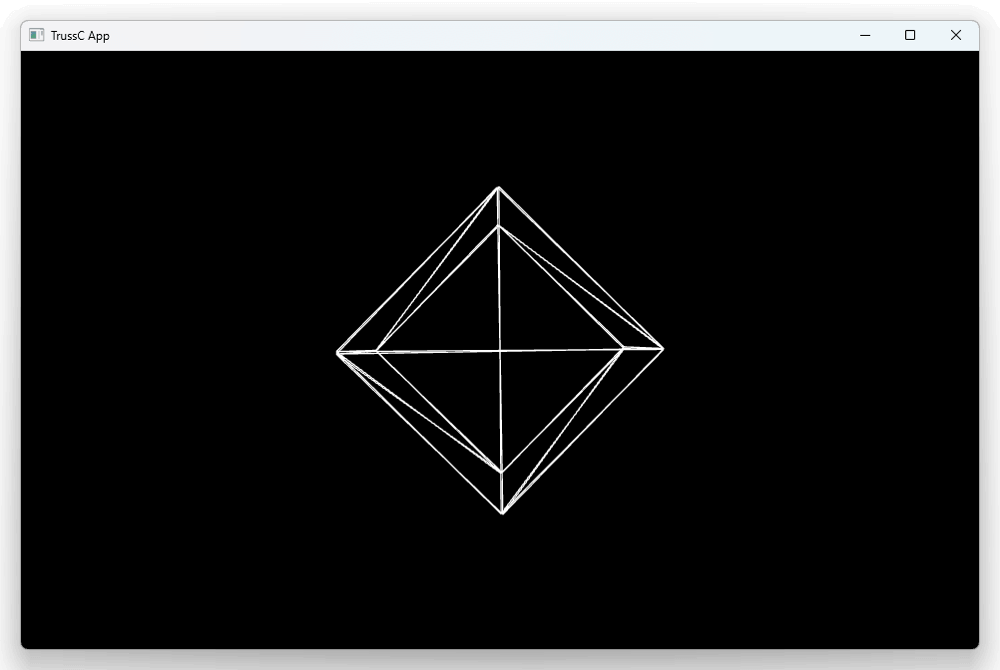

# jank TrussC test

[jank](https://jank-lang.org/) and [TrussC](https://github.com/TrussC-org/TrussC) integration test



Tested on Win/Mac/Linux (windows ver is checked using [jank-win](https://github.com/ikappaki/jank-win), mac/linux is used brew/apt, see [#installation](https://book.jank-lang.org/getting-started/01-installation.html))

## Run

```bash
$ lein run
```

## Dev

[TrussC-dll](https://github.com/funatsufumiya/TrussC-dll) is used instead of TrussC original code. Headers are modified for them, mainly for C dylib integration.